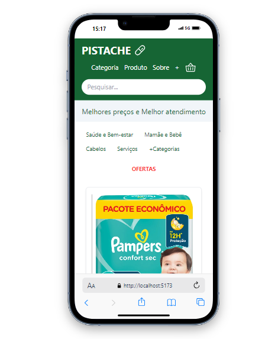
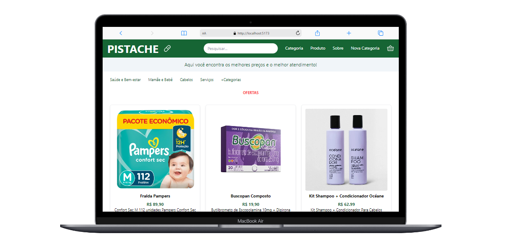

# Farmácia Front-end

Este é o projeto de front-end de uma farmácia desenvolvido como parte da aprovação prática no Bootcamp da Generation Brasil. O objetivo deste projeto é criar uma interface interativa e funcional para um site de farmácia, utilizando tecnologias modernas como React e CSS.

## 🚀 Funcionalidades

- **Catálogo de produtos**: Exibição de produtos organizados por categorias, com imagens e descrições.
- **Links e navegação**: Página de categorias, produtos e sobre, com navegação intuitiva.
- **Responsividade**: Layout ajustável para diferentes tamanhos de tela, proporcionando uma ótima experiência tanto em dispositivos móveis quanto em desktops.
- **Página de gerenciamento**: Opção de cadastrar novas categorias, permitindo a expansão do catálogo de produtos.

## 🛠️ Tecnologias Utilizadas

- **React.js**: Biblioteca JavaScript para construção da interface do usuário.
- **CSS e TailwindCSS**: Estilização responsiva e customizada para garantir design moderno e usabilidade.
- **React Router Dom**: Navegação entre as páginas da aplicação.
- **Phosphor Icons**: Conjunto de ícones utilizados para melhorar a interface.

## 📸 Capturas de Tela

Veja abaixo algumas imagens da interface:

<div style="display: flex; justify-content: space-around; gap: 10px; align-items: center;">
  
  
</div>

## 💻 Como Executar

1. Clone este repositório:
   ```bash
   git clone https://github.com/usuario/farmacia-front-end
